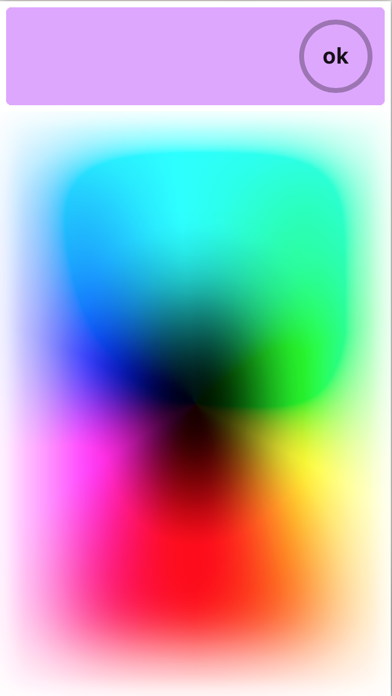

#this is f**king reinbou 

**Reinbou** is a [P5js](https://p5js.org)-based color selector gui package for touch-based applications. **Reinbou** is meant for `<input type='color'>` html elements.

###Dependencies

* [P5js](https://p5js.org)
* [JQuery](https://jquery.com)

###To Do

Tasks:

* built it as a reusable library:
* instances of `<input type="color" id="#####" class="rb">` where **rb** is the reinbou class
* Automate and compress js using gulp pr grunt from `src` to `js` directory. 
* make it jquery compatible

Idea:
* 
* every time you click (or tap) on a `<input type="color" id="#####" class="rb">` a div is dinamically created with the p5js canvas (modal-like, fullscreen). The modal closes with the **ok** button submitting the current color value.
* the returned color value (in hex) is used to style the `background-color` of the input


```html
<!-- create an element, pass in a pointer,
and attach it to the body -->
<!DOCTYPE html>
<head>
  <script src='rb.js'></script>
</head>
<body>
  <script>
  var sketch = function(p) {
    p.setup = function(){
      p.createCanvas(100, 100);
      p.background(0);
    }
  };
  var node = document.createElement('div');
  new p5(sketch, node);
  window.document.getElementsByTagName('body')[0].appendChild(node);
  </script>
</body>
</html>
```
